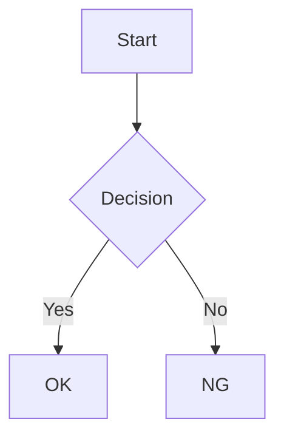

# lume-plugin-mermaid

A [Mermaid.js](https://mermaid.js.org/) plugin for [Lume](https://lume.land/).

Renders mermaid code blocks in Markdown as diagrams on the client side.

This plugin bundles mermaid and its assets (icon packs, etc.) locally during the build. The generated site has no external CDN dependency and can be fully self-hosted.

## Installation

Load the plugin in your `_config.ts`.

```ts
import lume from "lume/mod.ts";
import mermaid from "https://raw.githubusercontent.com/ansanloms/lume-plugin-mermaid/main/mod.ts";

const site = lume();

site.use(mermaid());

export default site;
```

## Usage

Write mermaid code blocks in your Markdown files.

````md

````

## Options

Pass an options object to `mermaid()` to customize behavior.

```ts
site.use(mermaid({
  version: "11.15.0",
  config: { theme: "forest" },
  icons: [
    {
      name: "logos",
      url: "https://unpkg.com/@iconify-json/logos@1.2.11/icons.json",
    },
  ],
  querySelector: "pre > code.language-mermaid",
  zoom: {
    enable: true,
    wheel: ["ctrl", "meta"],
    aspectRatio: "4:3",
  },
  scriptSrc: "/mermaid/scripts/mermaid.mjs",
}));
```

| Option          | Type          | Default                          | Description                                    |
| --------------- | ------------- | -------------------------------- | ---------------------------------------------- |
| `version`       | `string`      | `"11.15.0"`                      | Mermaid version to use                         |
| `config`        | `object`      | `{}`                             | Configuration passed to `mermaid.initialize()` |
| `icons`         | `IconPack[]`  | logos, aws                       | Icon packs to load                             |
| `querySelector` | `string`      | `"pre > code.language-mermaid"`  | CSS selector for mermaid target elements       |
| `zoom`          | `ZoomOptions` | see below                        | Pan & zoom behavior for rendered diagrams      |
| `scriptSrc`     | `string`      | `"/mermaid/scripts/mermaid.mjs"` | Path to the mermaid runner script              |

### Zoom

Rendered diagrams can be panned and zoomed — drag to pan, use the wheel or the on-screen buttons to zoom, and double-click to reset. Configure the behavior via the `zoom` option.

| Option        | Type                              | Default            | Description                                                                            |
| ------------- | --------------------------------- | ------------------ | -------------------------------------------------------------------------------------- |
| `enable`      | `boolean`                         | `true`             | Enable / disable pan & zoom                                                            |
| `wheel`       | `boolean \| ("ctrl" \| "meta")[]` | `["ctrl", "meta"]` | Wheel zoom. `false` = off, `true` = always, array = only while one of the keys is held |
| `aspectRatio` | `string`                          | `"4:3"`            | Aspect ratio of the pan/zoom area (e.g. `"16:9"`). Empty string = unconstrained        |
| `maxWidth`    | `string`                          | —                  | Max width of the pan/zoom area (CSS value, e.g. `"600px"`). Unset = no limit           |
| `maxHeight`   | `string`                          | —                  | Max height of the pan/zoom area (CSS value, e.g. `"80vh"`). Unset = no limit           |

### Custom Script

Use `scriptSrc` to replace the mermaid runner script with your own. The custom script must export a `run` function with the following signature.

```js
/**
 * @param {{ mermaid: Object, config: Object, icons: Icon[], querySelector: string, zoom: ZoomOptions }} options
 */
export const run = async (options) => {
  // ...
};
```

See `examples/docs/scripts/mermaid.js` for a color scheme integration example.

### Icon Packs

The following icon packs are loaded by default.

- **logos** — [Iconify logos](https://icon-sets.iconify.design/logos/)
- **aws** — [AWS Icons for PlantUML](https://github.com/awslabs/aws-icons-for-plantuml) (CC-BY-ND-2.0)

## License

[MIT](LICENSE)
