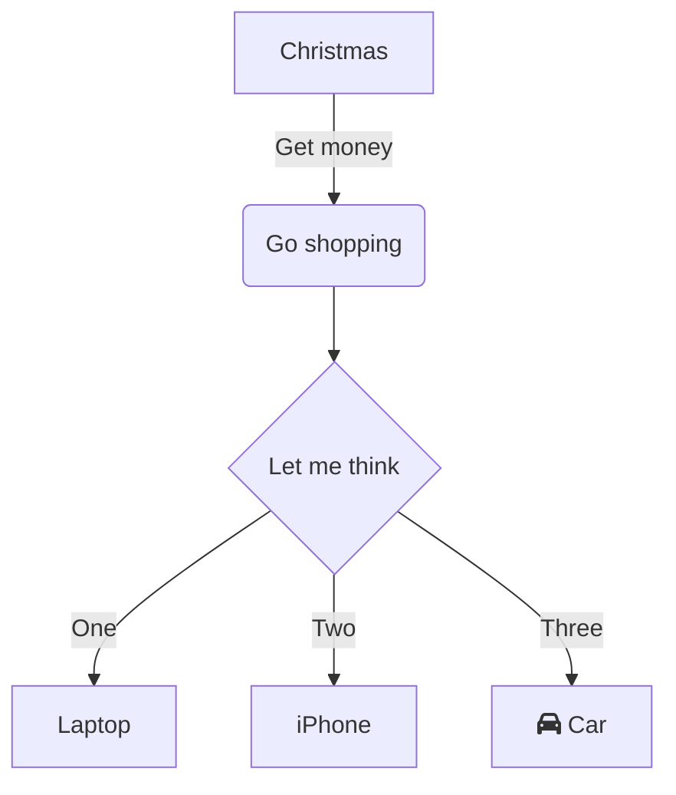

<a id="change-color-scheme" class="headerChangeColorScheme dark"></a>

### 通常のダイアグラム



### icon pack 読み込み

```mermaid
architecture-beta
    group api(logos:aws-lambda)[API]

    service db(logos:aws-aurora)[Database] in api
    service disk1(logos:aws-glacier)[Storage] in api
    service disk2(logos:aws-s3)[Storage] in api
    service server(logos:aws-ec2)[Server] in api

    db:L -- R:server
    disk1:T -- B:server
    disk2:T -- B:db
```



<https://github.com/mermaid-js/mermaid/issues/6109#issuecomment-2568656047>



```mermaid
---
config:
  theme: base
  themeVariables:
    darkMode: false
    archEdgeColor: "#232F3E"
    archEdgeArrowColor: "#232F3E"
    archGroupBorderColor: "#7D8998"
---
architecture-beta
  service user(aws:user)[User]
  group awscloud(aws:aws-cloud)[AWS Cloud]
  group region(aws:region)[Region] in awscloud

  group s3bucket(aws:simple-storage-service)[Amazon S3 bucket] in region

    service video(aws:multimedia)[video] in s3bucket
    service audio(aws:tape-storage)[audio] in s3bucket
    service transcript(aws:documents)[transcript] in s3bucket

    user:R -[1 upload]-> L:video
    video:R --> L:audio
    audio:R --> L:transcript

  service handler(aws:lambda-lambda-function)[ObjectCreated event handler] in region
  service mediaconvert(aws:elemental-mediaconvert)[AWS Elemental MediaConvert] in region
  service transcribe(aws:transcribe)[Amazon Transcribe] in region

  handler:T <-[2]- B:video
  mediaconvert:T -[3]-> B:audio
  transcribe:T -[4]-> B:transcript

  group workflow(aws:step-functions-workflow)[AWS Step Functions workflow] in region

    service extractaudio(aws:lambda-lambda-function)[extract audio] in workflow
    service transcribeaudio(aws:lambda-lambda-function)[transcribe audio] in workflow

    extractaudio:R --> L:transcribeaudio
    extractaudio{group}:L <-[Start Execution]- B:handler
    extractaudio:T --> B:mediaconvert
    transcribeaudio:T --> B:transcribe
```

### 壊れたダイアグラム

```mermaid
壊れたダイアグラム。
```
